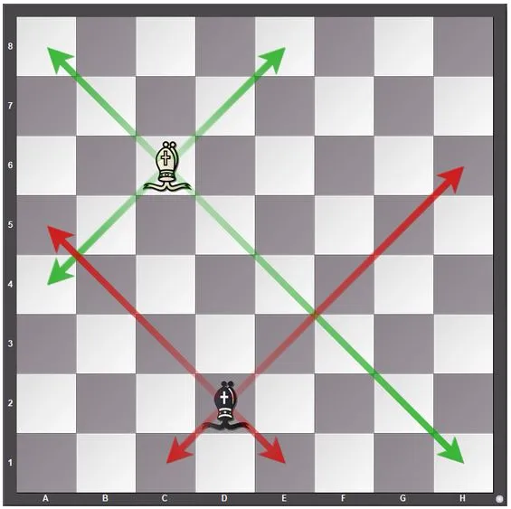

# Others: Maths

## Problem Title:
<a href="https://www.interviewbit.com/problems/total-moves-for-bishop/">Total Moves For Bishop </a>

## Problem Summary:
Given the position of a bishop on a standard 8×8 chessboard represented by two integers `A` (row) and `B` (column), calculate the total number of valid moves the bishop can make from that position.  
A bishop moves diagonally in any direction, and it can move until it reaches the edge of the board.

For example, if the bishop is at position (4,4), it can move diagonally in all four directions until the edges are reached.

## Approach:
The bishop's movement is determined by how far it can go diagonally in four directions:

1. Top-right diagonal → moves limited by distance to top edge and right edge.
2. Bottom-right diagonal → moves limited by distance to bottom edge and right edge.
3. Bottom-left diagonal → moves limited by distance to bottom edge and left edge.
4. Top-left diagonal → moves limited by distance to top edge and left edge.

To calculate the total moves:

- For each diagonal direction, find the minimum distance to the board’s edge.
- Sum up the possible moves in all four directions.

The algorithm uses `min` to ensure the bishop doesn't go past the board boundaries.  


## Code:

```cpp
int Solution::solve(int A, int B) {
    int count = 0;
    count += min(8-A, 8-B);   // top-right diagonal moves
    count += min(8-A, B-1);   // top-left diagonal moves
    count += min(A-1, B-1);   // bottom-left diagonal moves
    count += min(A-1, 8-B);   // bottom-right diagonal moves
    return count;
}
```

## Complexity Analysis:  

- Time Complexity: O(1), since only a fixed number of calculations are performed.  
- Space Complexity: O(1), only a few integer variables are used.